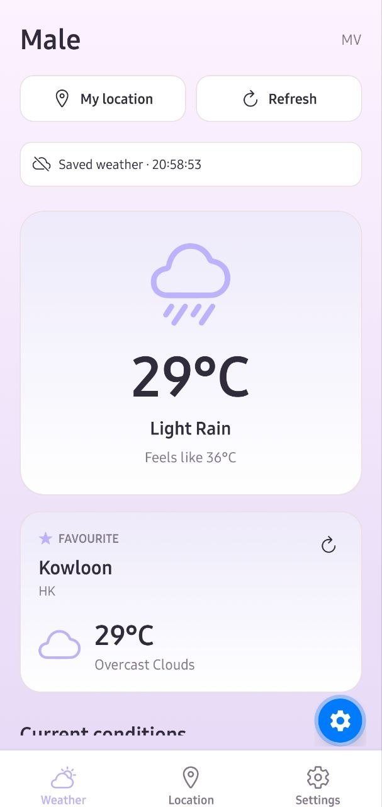
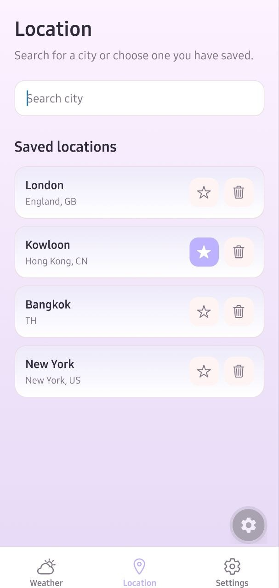
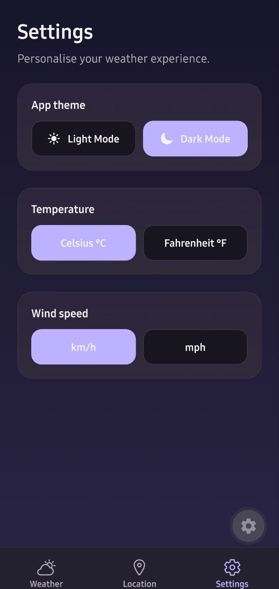
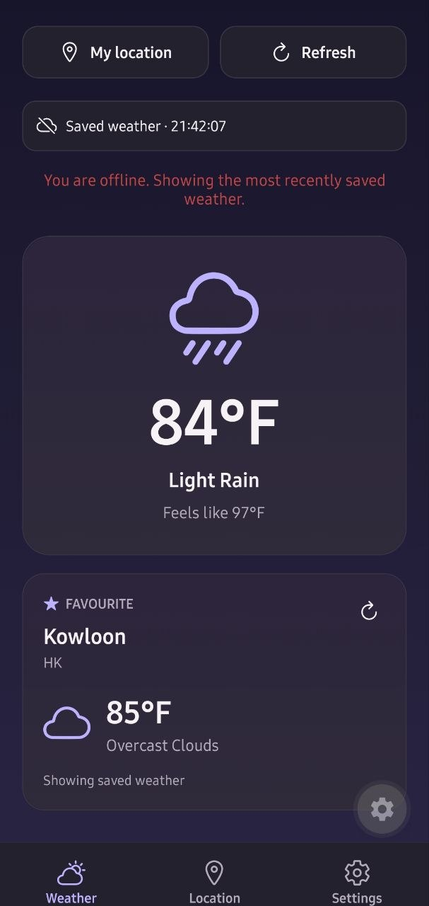
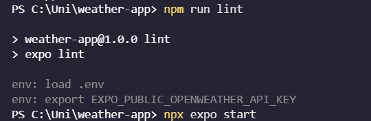

# Welcome to my Weather app👋

A mobile weather application built with React Native and Expo. It displays current weather conditions, upcoming forecasts, and a five-day forecast using the OpenWeather API.

The app supports device location, city search, saved locations, a favourite city, light and dark themes, temperature and wind-speed preferences, and offline access to recently saved weather data.

## Installation and Run Instructions

### Prerequisites

- Node.js and npm
- Expo Go
- An OpenWeather API key

### Setup

1. Clone or download this repository.

2. Install dependencies:

   ```bash
   npm install
   ```

3. Create a `.env` file in the project root:

   ```env
   EXPO_PUBLIC_OPENWEATHER_API_KEY=your_openweather_api_key
   ```

4. Start the Expo development server:

   ```bash
   npx expo start
   ```

5. Scan the QR code using Expo Go.

## Features

- **Current weather**  
  Displays the current temperature, weather condition, feels-like temperature, humidity, wind speed, visibility, and pressure.

- **Upcoming forecast**  
  Shows the next eight three-hour forecast entries supplied by OpenWeather.

- **Five-day forecast**  
  Groups forecast data by day and displays the expected weather condition with minimum and maximum temperatures.

- **Current location**  
  Requests foreground location permission and loads weather for the device’s current coordinates.

- **City search**  
  Provides live city suggestions while typing, using OpenWeather’s geocoding API.

- **Saved locations**  
  Cities can be saved for quick access and removed when no longer needed.

- **Favourite city**  
  One saved city can be marked as a favourite and is displayed as a secondary weather card on the Home screen.

- **Offline functionality**  
  The most recently loaded weather and favourite weather are saved with AsyncStorage. When offline, the app displays cached data when available.

- **Theme preferences**  
  Users can switch between light and dark mode. The selected theme is saved locally.

- **Unit preferences**  
  Temperature can be changed between Celsius and Fahrenheit. Wind speed can be shown in km/h or mph. Both preferences persist after the app is closed.

- **Error handling**  
  The app handles missing API keys, invalid API keys, denied location permission, unavailable locations, network problems, empty search results, and unavailable cached data.

## Screenshots

### Home screen



### Location and navigation screen



### Settings screen



### Offline cached weather



### Clean Lint Check



## Technologies Used

- **React Native** — mobile user interface development
- **Expo** — React Native development and testing with Expo Go
- **Expo Router** — tab-based navigation between Weather, Location, and Settings
- **TypeScript** — typed application code
- **OpenWeather API** — current weather, forecast, and city geocoding data
- **AsyncStorage** — local persistence for preferences, saved cities, favourite city, and cached weather
- **Expo Location** — device location permission and coordinates
- **Expo Network** — network availability checks for offline support
- **Expo Linear Gradient** — gradient backgrounds and weather cards
- **Ionicons** — weather, navigation, and action icons

## Testing

The application was manually tested in Expo Go on Android.

- Weather data loaded successfully for device location and searched cities.
- Saved cities and favourite city persisted after restarting the app.
- Theme, temperature, and wind-speed preferences persisted after restarting the app.
- Offline mode was tested by disabling network access; cached weather was shown when available.
- Location permission denial, empty search results, and API/network errors were handled with user-facing messages.
- Code quality was checked with:

  ```bash
  npm run lint
  ```

## Known Issues and Future Improvements

- The free OpenWeather forecast updates in three-hour blocks, so it is not a fully hourly forecast.
- When offline, the app can show saved weather for the last city viewed and the favourite city, but not every saved location.
- Weather updates when the user refreshes the page or chooses a city. It does not refresh automatically in the background.
- In the future, the app could add weather alerts, sunrise and sunset details, saved weather for more cities, and weather-based backgrounds.
